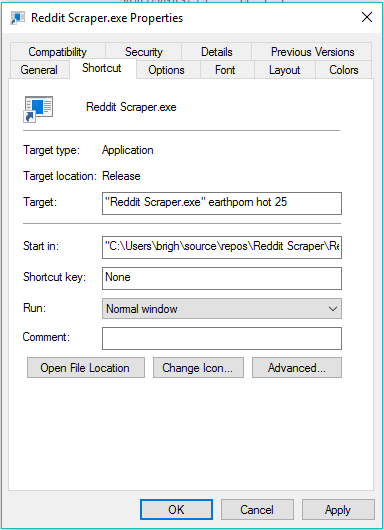
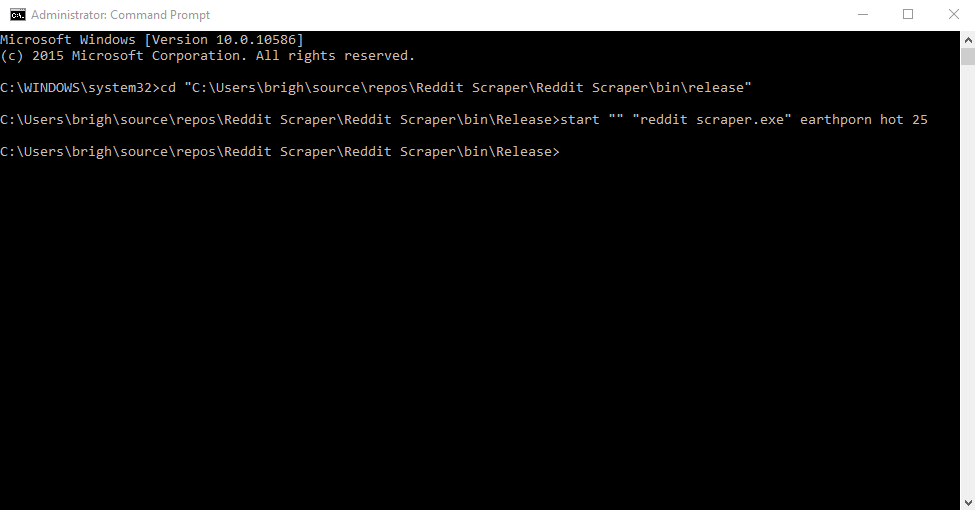

# Reddit-Downloader

A tiny executable to download images from subreddits. Although it's a .exe file, it uses CLI-like arguments to define what subs to download for, what category and how many posts.

It downloads the following formats to the same directory as the .exe:

	.png
	.jp(e)g
	.gif

## Arguments

Argument[0] = subreddit

Argument[1] = category (new / hot / top / controversial)

Argument[2] = amount of posts to scrape (images are downloaded from posts that contain direct links)

# Usage

## Shortcut

## CLI

	start "" "pathtoexe.exe" earthporn hot 25

# Donate if you like my work (click the image)

